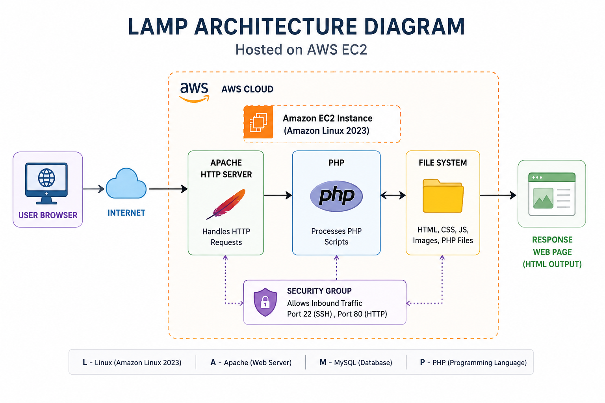
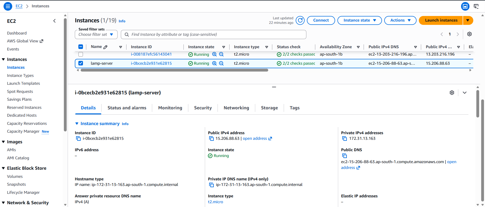
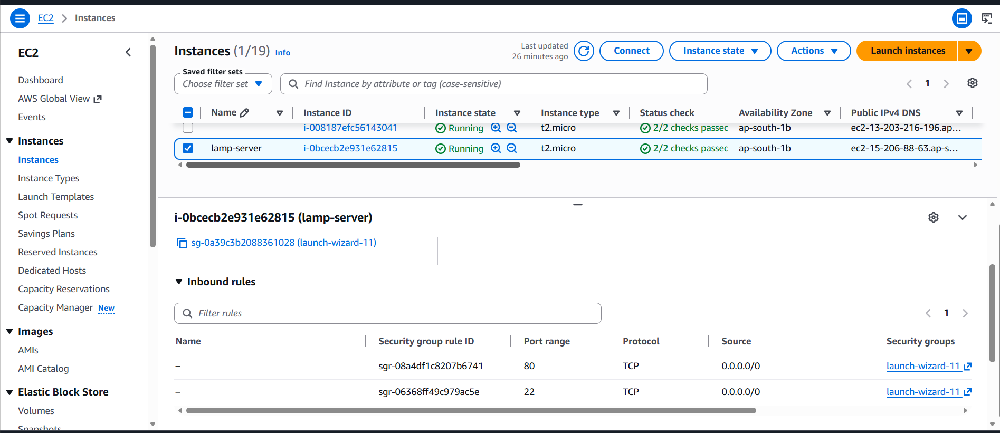
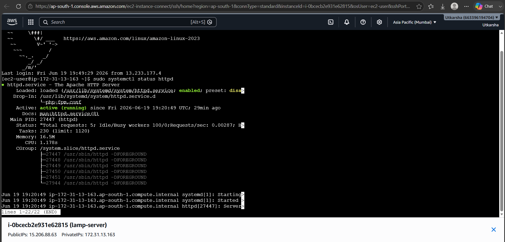
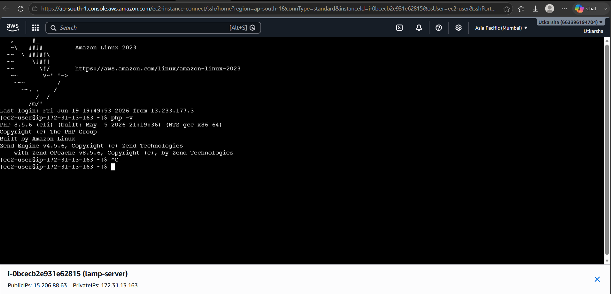
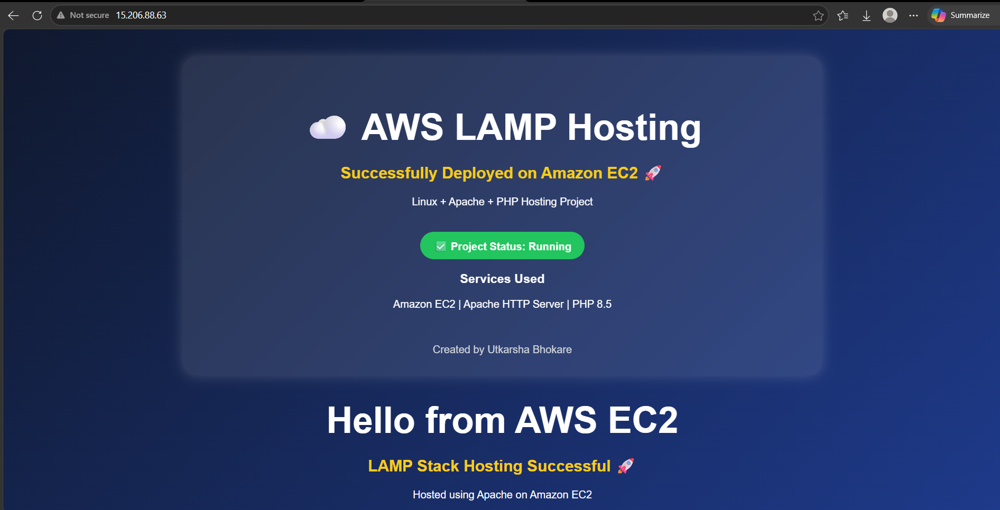

# 🚀 AWS LAMP Hosting Project

## 📌 Project Overview

This project demonstrates the deployment of a LAMP (Linux, Apache, PHP) web application on AWS EC2. The web server was configured using Amazon Linux 2023, Apache HTTP Server, and PHP 8.5. The application was successfully hosted and made publicly accessible over the internet.

---

# 🏗️ Architecture Diagram



## Architecture Explanation

This project follows a simple LAMP architecture hosted on AWS.

- The user accesses the website through a web browser.
- The request travels through the Internet to the AWS EC2 instance.
- Apache HTTP Server receives the request.
- PHP processes the request on the server.
- The response is returned back to the user's browser.

This architecture demonstrates how Linux, Apache, and PHP work together to host web applications on AWS infrastructure.

---

# ☁️ Step 1: Launch EC2 Instance

An Amazon EC2 instance was launched using Amazon Linux 2023 AMI.

### 📸 EC2 Instance Running



### Key Details

- Amazon Linux 2023
- t2.micro Instance
- Public IP Enabled
- SSH Access using Key Pair

---

# 🔒 Step 2: Configure Security Group

Inbound rules were configured to allow SSH and HTTP traffic.

### 📸 Security Group Configuration



### Rules Configured

| Type | Port |
|--------|--------|
| SSH | 22 |
| HTTP | 80 |

---

# 🌐 Step 3: Install Apache Web Server

Apache HTTP Server was installed and configured.

### Commands Used

```bash
sudo dnf update -y
sudo dnf install httpd -y
sudo systemctl start httpd
sudo systemctl enable httpd
```

### 📸 Apache Service Status



### Verification

Apache service status showed:

```bash
Active: active (running)
```

which confirms that the web server is running successfully.

---

# ⚙️ Step 4: Install PHP

PHP was installed to enable dynamic web page hosting.

### Commands Used

```bash
sudo dnf install php php-cli php-mysqlnd -y
php -v
```

### 📸 PHP Installation Verification



### Verification

The output confirmed:

- PHP 8.5.6 Installed
- Zend Engine Enabled
- Amazon Linux Build

---

# 🎨 Step 5: Deploy Custom Web Page

A custom landing page was created and deployed in:

```bash
/var/www/html
```

### 📸 Final Website Output



### Features

- Modern UI Design
- Responsive Layout
- Hosted on AWS EC2
- Served using Apache

---

# 🛠️ AWS Services Used

- Amazon EC2
- Amazon Linux 2023
- Apache HTTP Server
- PHP 8.5
- Security Groups

---

# 📂 Project Structure

```text
AWS-LAMP-Hosting-Project
│
├── index.html
├── README.md
│
└── screenshots
    ├── lamp-architecture-diagram.png
    ├── ec2-running.png
    ├── security-group.png
    ├── apache-status.png
    ├── php-installation.png
    └── website-output.png
```

---

# 🎯 Project Outcome

✅ Successfully launched an EC2 instance

✅ Configured Security Groups

✅ Installed and configured Apache Web Server

✅ Installed PHP 8.5

✅ Hosted a custom web application

✅ Made the application publicly accessible

---

# 🌐 Live Website

### Click Below To Open

**http://15.206.88.63**

---

---

# 👩‍💻 Author

**Utkarsha Bhokare**

☁️ Cloud Computing Enthusiast

### Technologies Used

AWS EC2 • Amazon Linux 2023 • Apache HTTP Server • PHP 8.5 • Linux • GitHub

### Tags

#AWS #CloudComputing #AmazonEC2 #LAMPStack #Apache #PHP #Linux #WebHosting #DevOps #GitHub

---

⭐ Don't forget to star this repository if you found it helpful!